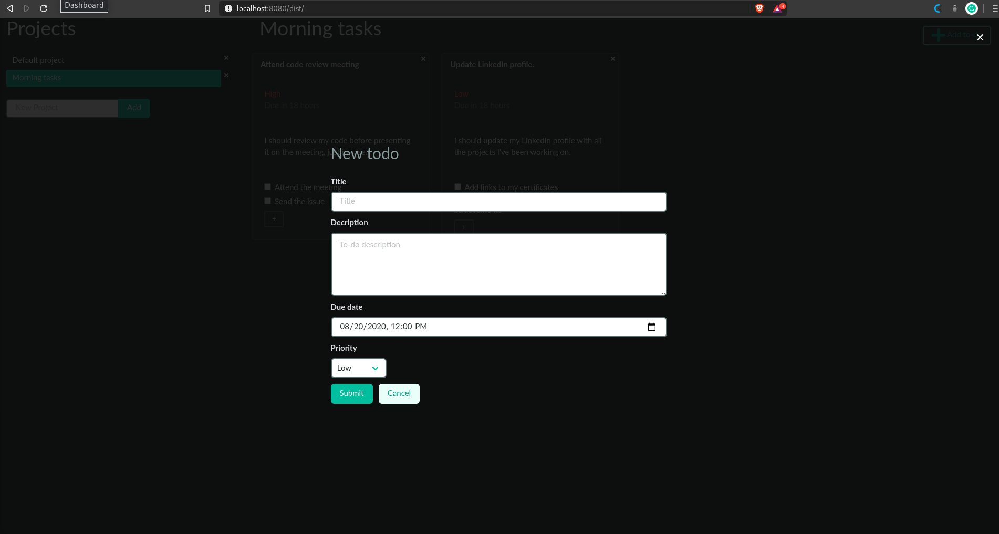
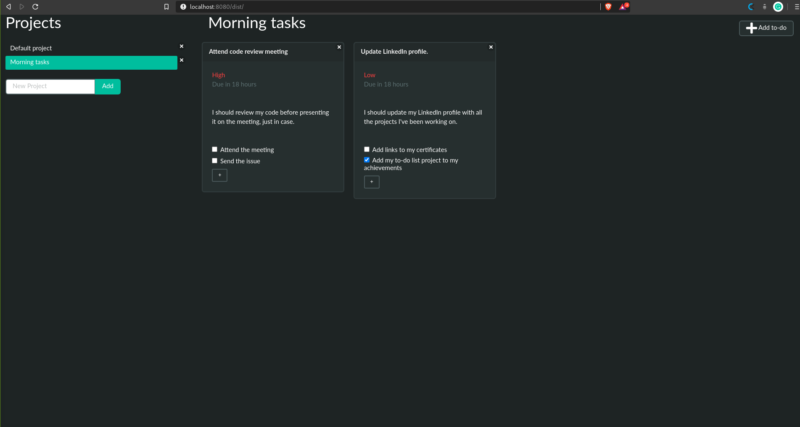

# To-do List

This is a JavaScript implementation of a To-do list web application. It's a single-page application that allows the user to track their day to day activities in separate projects. 
The assignment for this project can be found [here](https://www.theodinproject.com/courses/javascript/lessons/todo-list)

  
  
  ## Liveview
  - [Live version](https://raw.githack.com/ivanid22/to-do-list/to-do-list/dist/index.html) 
  
  ## Built With
  - JavaScript (ES6)
  - Webpack
  - [Bulma](https://bulma.io/)

  ## Authors

  👤 **Franco Rosa**

  - Github: [@Franco Rosa](https://github.com/FrancoRosa)
  - Twitter: [@francomaker](https://twitter.com/francomaker)
  - Linkedin: [Franco Rosa](https://www.linkedin.com/in/francoro/)

  👤 **Ivan Diaz**

  - Github: [@ivanid22](https://github.com/ivanid22)
  - Twitter: [@ivanid22](https://twitter.com/ivanid22)
  - Linkedin: [Ivan Diaz](www.linkedin.com/in/ivanid22)

  ## 🤝 Contributing

   - Contributions, issues and feature requests are welcome!

   - Feel free to check the [issues page](https://github.com/elmejdki/TubeClone/issues).

  ## Show your support

   - Give a ⭐️ if you like this project!

  ## 📝 License

  This project is [MIT](lic.url) licensed.
